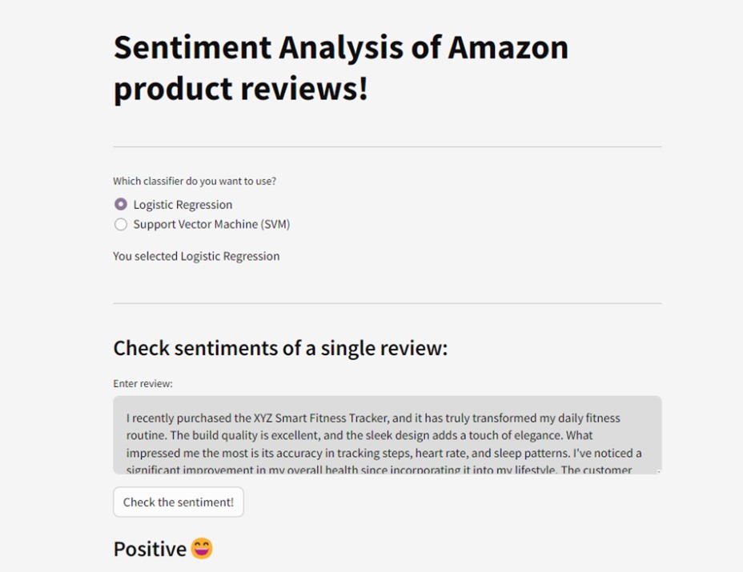
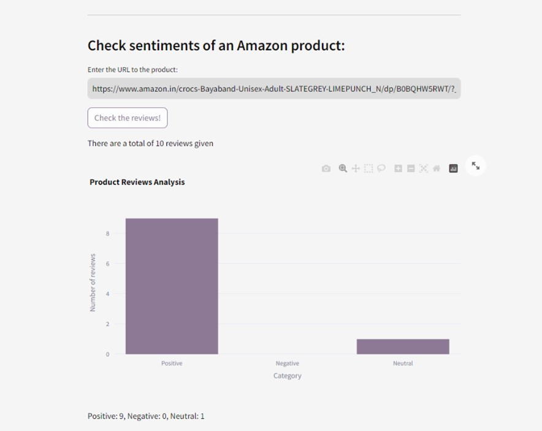
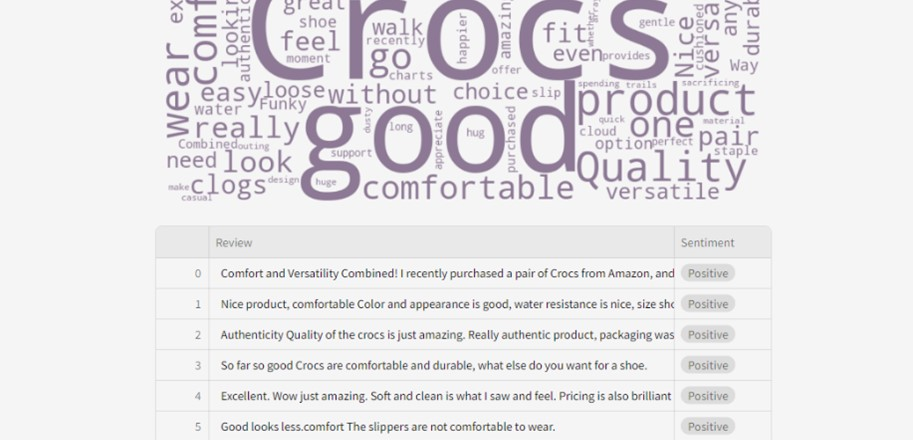
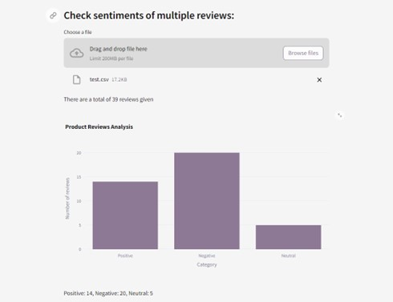
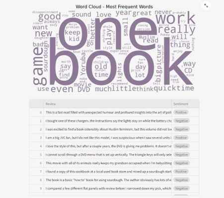

# Sentiment Analysis of Amazon Reviews 🛒📝📊

## Overview

This project focuses on sentiment analysis using machine learning and natural language processing techniques. The goal is to develop a Streamlit app capable of analyzing sentiments in various scenarios, including single-line reviews, multiple reviews from CSV files, and product reviews from Amazon URLs.

## Dataset Used

The Amazon reviews full score dataset is constructed by randomly taking 6,00,000 training samples and 1,30,000 testing samples for each review score from 1 to 5. In total there are 30,00,000 training samples and 6,50,000 testing samples.

[Kaggle Link to the Dataset](https://www.kaggle.com/datasets/bittlingmayer/amazonreviews/data)


## Project Structure

- **notebooks**: Contains Jupyter notebooks with exploratory data analysis and model development.
- **test files**: Contains test files to test out sentiment analysis for multiple reviews.
- **.streamlit**: Contains the configuration file for the streamlit app's theme
- **models.p**: Stores serialized models for sentiment analysis.
- **review_analyzer.py**: Houses the Streamlit app code for interactive sentiment analysis.
- **reviewscrapper.py**: Includes Python scripts for web scraping reviews for a certain URL.
- **requirements.txt**: Lists the project dependencies for reproducibility.

  
## Setup

1. Clone the repository:

    ```bash
    git clone https://github.com/amri-tah/Amazon-Reviews-Sentiment-Analysis.git
    ```

2. Navigate to the project directory:

    ```bash
    cd Amazon-Reviews-Sentiment-Analysis
    ```

3. Install dependencies:

    ```bash
    pip install -r requirements.txt
    ```

4. Open terminal and run the Streamlit app:
    ```bash
    streamlit run review_analyzer.py
    ```

## Usage

1. Explore and run Jupyter notebook `B8_Amazon.ipynb` in the `notebooks` folder for data analysis and model development.

2. Execute Python scripts in the `reviewscrapper.py` for web scraping.

3. Run the Streamlit app for interactive sentiment analysis:

    ```bash
    streamlit run review_analyzer.py
    ```

## Screenshots


### Streamlit App:
#### Single Reviews:


#### Product URL Reviews:



#### Multi Review:


